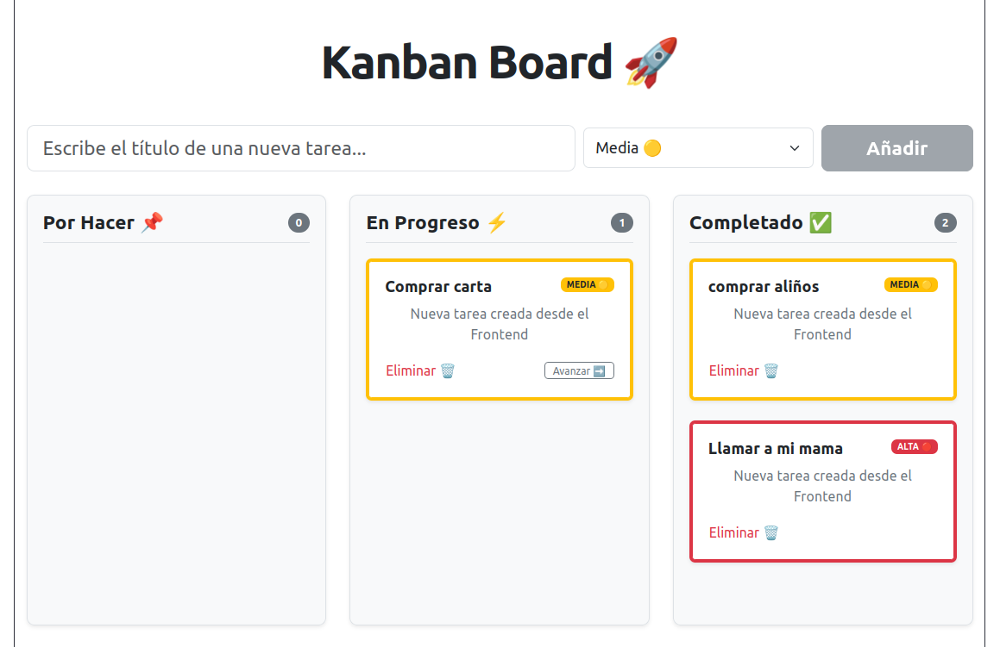

# Kanban Task Manager 🚀

Un tablero Kanban interactivo y profesional con arquitectura desacoplada (Full-Stack). El proyecto cuenta con un backend robusto para la persistencia de datos y un frontend dinámico que implementa las mejores prácticas del ecosistema moderno.

 

## 🛠️ Stack Tecnológico

### Frontend
- **React 19 & Vite** como entorno de desarrollo ágil.
- **TypeScript** con tipado estricto (`verbatimModuleSyntax`).
- **Bootstrap 5** para un diseño visual moderno, responsivo y limpio.
- **Axios** para la gestión de peticiones HTTP de forma centralizada.

### Backend & Base de Datos
- **Laravel** encargado de exponer una API RESTful estructurada.
- **MySQL** como motor de base de datos relacional para la persistencia real.

## ✨ Características Principales (Features)
- **Persistencia en tiempo real:** Gestión completa de tareas conectada directamente a la base de datos (CRUD).
- **Control de Prioridades:** Renderizado dinámico de tarjetas (`Baja 🟢`, `Media 🟡`, `Alta 🔴`) con estilos visuales condicionales.
- **Drag and Drop Nativo:** Movimiento fluido de tarjetas entre columnas utilizando la API de HTML5.
- **Manejo de Estados de Carga (Loading States):** Bloqueo y atenuación visual de tarjetas individuales (*"Sincronizando..."*) durante las peticiones asíncronas para evitar colisiones de red.
- **Resiliencia ante Errores:** Control de excepciones del servidor con alertas interactivas para el usuario en caso de fallas de conexión.
- **Arquitectura Limpia:** Separación estricta de responsabilidades mediante componentes modulares reutilizables.
- **Seguridad en Configuración:** Gestión de variables de entorno mediante archivos `.env`.

## 🚀 Instalación y Configuración

El proyecto está dividido en dos directorios independientes:

### 1. Configuración del Backend (`task-manager-api`)
```bash
cd task-manager-api
composer install
cp .env.example .env  # Configura tus credenciales de MySQL aquí
php artisan key:generate
php artisan migrate
php artisan serve
```

### 2. Configuración del Frontend (`task-manager-front`)
```bash
cd task-manager-front
npm install
```

Crea un archivo .env.local en la raíz de la carpeta del frontend y añade la URL de tu API:

```text
VITE_API_BASE_URL=[http://127.0.0.1:8000/api](http://127.0.0.1:8000/api)
```

Finalmente, arranca el servidor de desarrollo:
```bash
npm run dev
